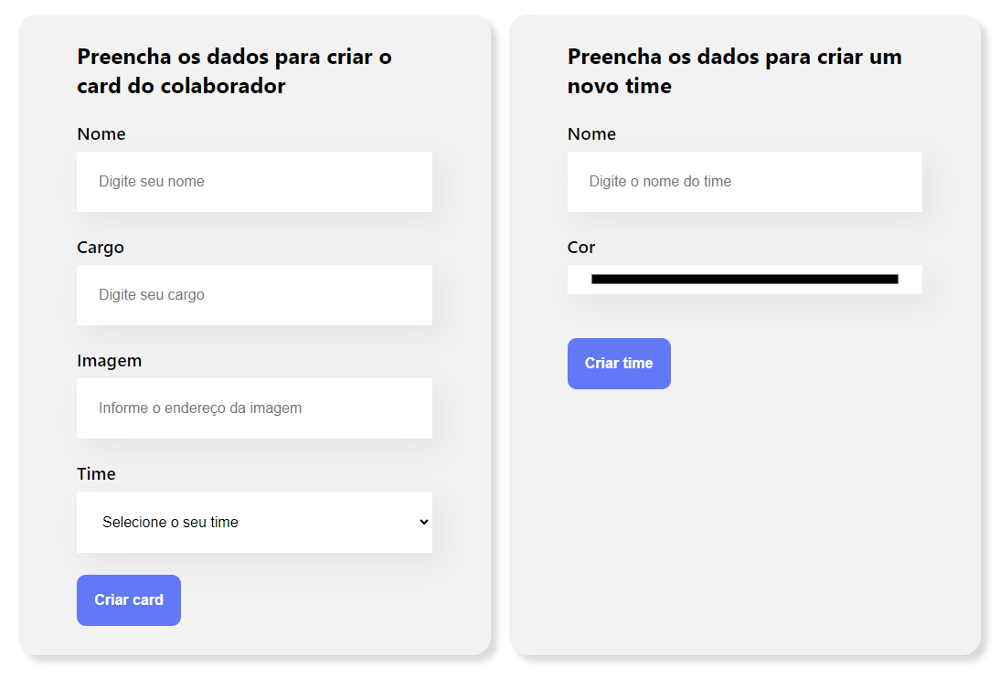
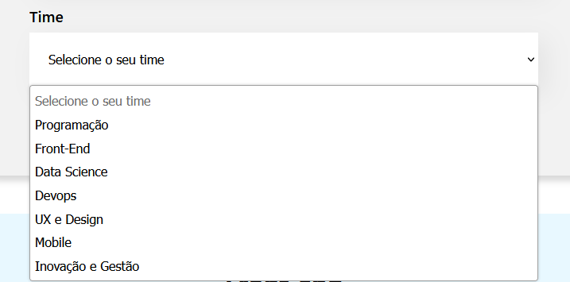
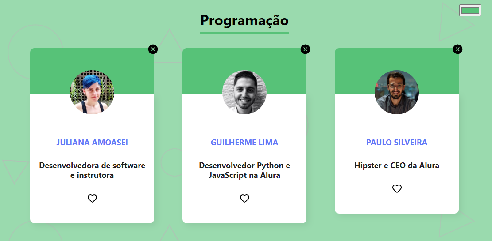
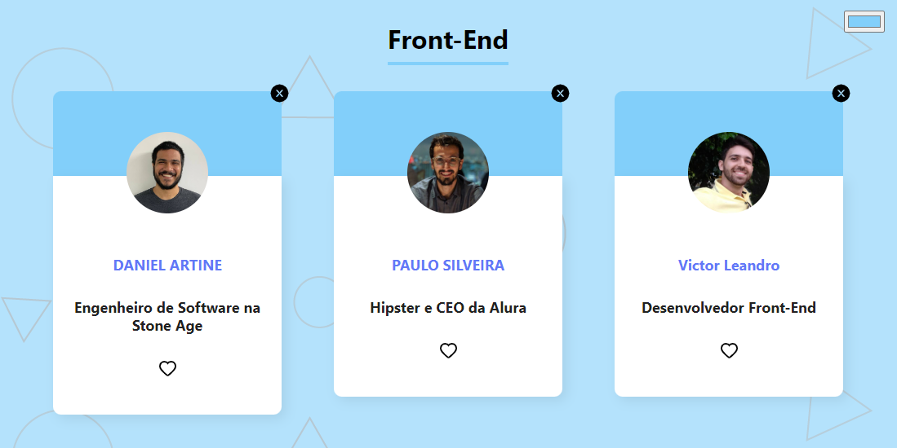

<h1 align="center">Organo</h1>

<p align="center">Desenvolvido durante curso da Alura para aprender React</p>

<div align="center">
  <a href="#-projeto">Projeto</a>&nbsp;&nbsp;&nbsp;|&nbsp;&nbsp;
  <a href="#-tecnologias">Tecnologias</a>&nbsp;&nbsp;&nbsp;|&nbsp;&nbsp;
  <a href="#-como iniciar">Como iniciar</a>
</div>

## 






## Projeto

&nbsp;&nbsp;&nbsp;&nbsp;&nbsp;Projeto realizado durante curso da Alura, desenvolvido em React.js para a criação de um organograma, em que foram criados componentes para melhor organização e reaproveitamento de código, validação de formulário e filtragem para que cada colaborador cadastrado fosse direcionado para o seu respectivo time.

## Tecnologias

Esse projeto foi desenvolvido com as seguintes tecnologias:

- React
- JavaScript
- HTML5
- CSS3

## Como iniciar

- Pré-requisitos:

  - Git
  - Node.js
    </br></br>

- Clonar o repositório;
- No diretório raiz, executar:

```
npm install
```

- Após a instalação, iniciar o projeto:

```
npm start
```
